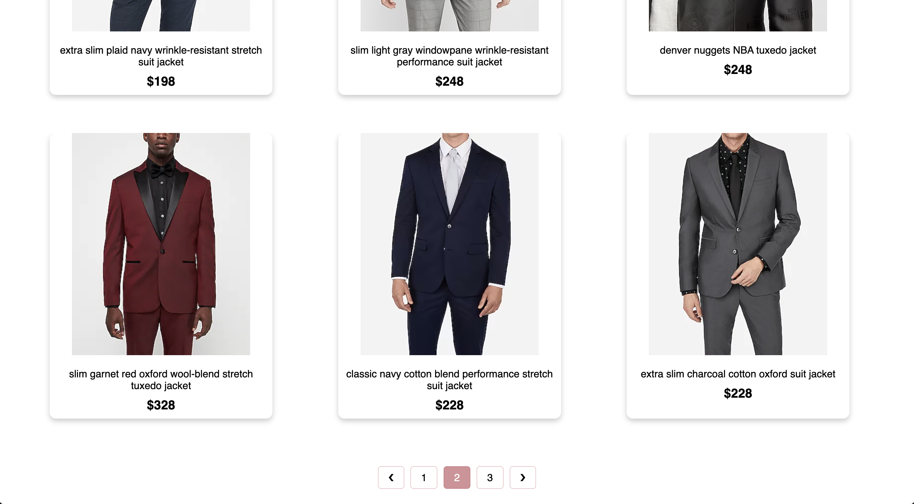
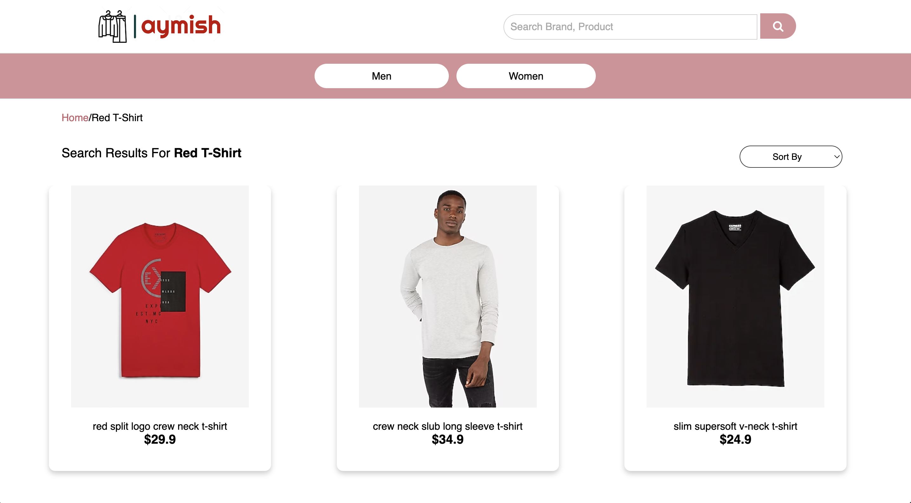
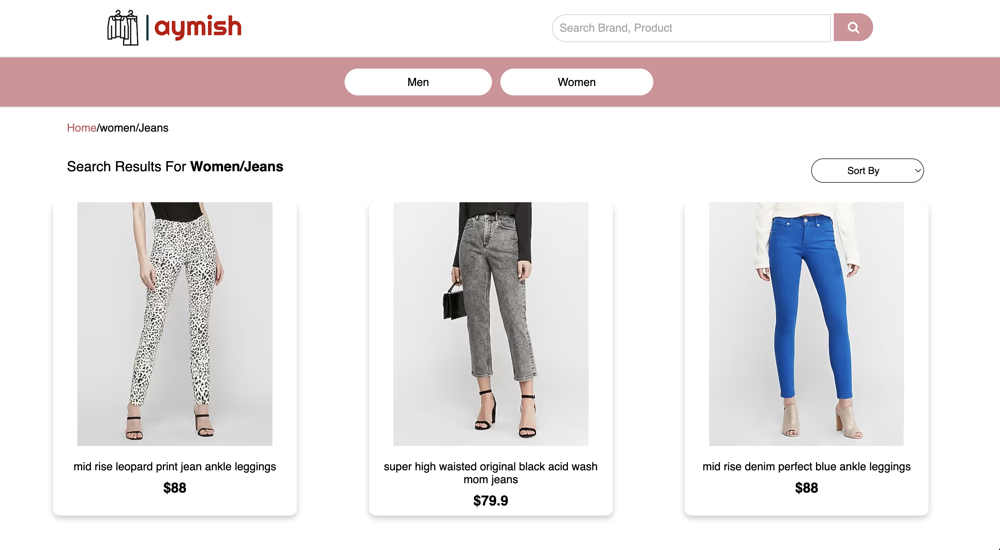
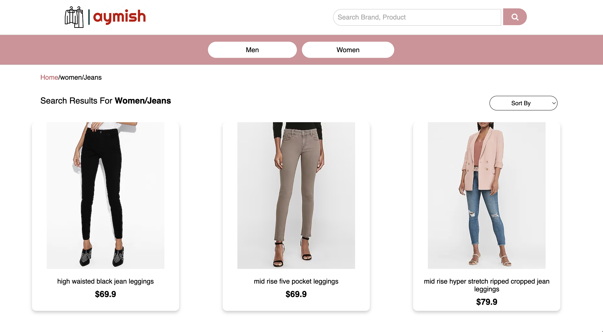

# aymish-apparels (Team-6)
Simple e-commerce website

# Summary
* The repository contains code used to build a simple e-commerce website **Aymish Apparels** 
* Users can:
    * search for products
    * shortlist products according to categories
    * view the above in sorted manner
* Vendors can:
    * insert products to the catalog using the ingestion API
* Technologies used:
    * **Frontend**:
        * HTML
        * CSS
        * JS
    * **Backend**:
        * Python flask
    * **Database**:
        * PostgreSQL
    * **Cache**:
        * Redis
    * **External API**:
        * [Unbxd Search API](https://search.unbxd.io/fb853e3332f2645fac9d71dc63e09ec1/demo-unbxd700181503576558/search)
    * **Containerization**:
        * Docker
    * **Deployment**:
        * Kubernetes
            * kubectl
            * minikube
            * kompose
    
# API Specs:
* Retrieve no. of pages for a given category
```
GET-
GET http://localhost:5000/category-pagination?catlevel2Id=* HTTP/1.1
Host: localhost
```

* Retrieve name tree in bottom-up manner for a given category
```
GET-
GET http://localhost:5000/name-tree?catlevel2Id=* HTTP/1.1
Host: localhost
```

* Retrieve level1 categories having subcategories
```
GET-
GET http://localhost:5000/cat-level-1 HTTP/1.1
Host: localhost
```
* Retrieve level2 categories belonging to level 1 category
```
GET-
GET http://localhost:5000/cat-level-2-with-parent-id?catlevel1Id=* HTTP/1.1
Host: localhost
```

* Retrieve products using category drop-down list
```
GET-
GET http://localhost:5000/category-product-list?catlevel2Id=* HTTP/1.1
Host: localhost
```

* Retrieve product details
```
GET-
GET http://localhost:5000/product?uniqueId=* HTTP/1.1
Host: localhost
```

* Retrieve products using search bar
```
GET-
GET http://localhost:5000/search?q=*&sort=*&page=* HTTP/1.1
Host: localhost
```
* Data ingestion
```
POST-
POST http://localhost:5000/ingestion HTTP/1.1
Host: localhost
```

* Recommendations
```
GET-
GET http://localhost:5000/recommendations?uniqueId=* HTTP/1.1
Host: localhost
```

# Link to postman collection:
https://api.postman.com/collections/25326353-5ea394d3-73c9-46ce-97a4-20af33abcd58?access_key=PMAT-01GRTFDM662MCJRDJHTJJCDSJP

# API Documentation
https://documenter.getpostman.com/view/25326353/2s93CHuavF

# Building the image and pushing to dockerhub
* Frontend
    ```
    docker image build -t manish09/frontend . 
    docker image push manish09/frontend
    ``` 
* Backend
    ```
    docker image build -t manish09/backend . 
    docker image push manish09/backend
    ``` 

# Running the services
* Frontend
    * run at port 8080 via nginx-server
* Backend
    * run at port 5000 via flask
    * Data ingestion  
        ```
        curl -X POST -H "Content-Type: application/json" -d @out.json http://127.0.0.1:5000/ingestion
        ```
        
# To deploy in kubernetes, follow the below steps
* In terminal 1, enter the following commands, in the root directory of the repository
    ```
    minikube start
    minikube addons enable ingress-dns
    minikube addons enable ingress
    kompose convert
    kubectl apply -f aymish-apparels-default-networkpolicy.yaml,backend-deployment.yaml,backend-service.yaml,frontend-deployment.yaml,frontend-ingress.yaml,frontend-service.yaml,postgres-deployment.yaml,postgres-service.yaml,redis-deployment.yaml,redis-service.yaml
    minikube tunnel
    ```

* In terminal 2, enter the following command (ensure that backend deployment has started running)
    ```
    kubectl port-forward service/backend 5000:5000
    ```

* In terminal 3, enter the following commands
    ```
    cd ${out_json_file_directory}
    curl -X POST -H "Content-Type: application/json" -d @out.json http://localhost:5000/ingestion
    ```

* Open the following [URL](http://localhost:8080/index.html) in browser to open the website 
        
# Screenshots
* Home page


* Pagination


* Search products list page


* Category products list page (normal)


* Category products list page (sorted)


* Product details page


* Product page with recommendations

